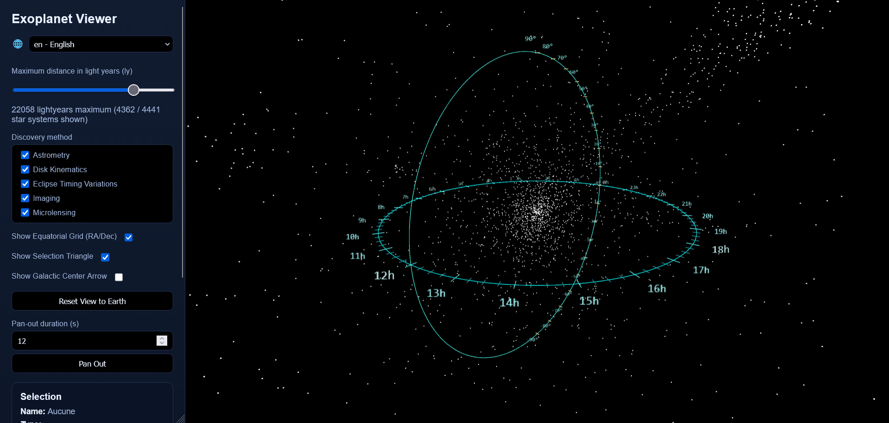

# planedo

- [English](exoplanet-position-visualizer)
- [Français](visualisateur-de-positions-d-exoplanetes)

## Exoplanet Position Visualizer

A simple Web page to view the position of confirmed exoplanets.

### How to Access It

- **Online**: Access https://vincent-therrien.github.io/planedo/home.html
- **Offline**: Clone this repository and open the file `viewer/home.html` in a Web browser.

### Features

- Display exoplanet positions in 3D
- Display indicators to situate positions with respect to Earth, such as:
  - Right ascension and declination
  - Ecliptic and galactic planes
  - Indication for the direction toward the center of the galaxy
- Provide data for selected star systems, such as mass and radius of each planet as well as links
  to NASA's exoplanet catalog.

All data used in this project are taken from the
[NASA Exoplanet Archive](https://exoplanetarchive.ipac.caltech.edu/). An exoplanet viewer from NASA
is also accessible at https://eyes.nasa.gov/apps/exo/# (I made this project because I had trouble
visualizing where the planets are located in the NASA viewer).

## Visualisateur de positions d'exoplanètes

Une page Web simple pour visualiser les positions d'exoplanètes dont l'existence est confirmée.

### Utilisation

- **En ligne** : Accédez à la page https://vincent-therrien.github.io/planedo/home.html
- **Hors ligne** : Clônez ce dépôt et ouvrez le ficher `viewer/home.html` dans un navigateur Web.

### Fonctionnalités

- Afficher les positions des exoplanètes en 3D
- Afficher des indicateurs pour mieux situer les positions par rapport à la Terre :
  - Ascension droite et déclinaison
  - Plans écliptique et galactique
  - Indicateur de la direction du centre de la galaxie
- Liens vers le catalogue d'exoplanètes de la NASA et informations sur les caractéristiques des
  exoplanètes.

Toutes les données utilisées dans ce projet sont tirées du
[NASA Exoplanet Archive](https://exoplanetarchive.ipac.caltech.edu/). Un visualisateur d'exoplanètes
de la NASA est par ailleurs accessible à https://eyes.nasa.gov/apps/exo/#, mais j'ai fait ce projet
parce que je voulais mieux visualiser les positions par rapport à la Terre.
